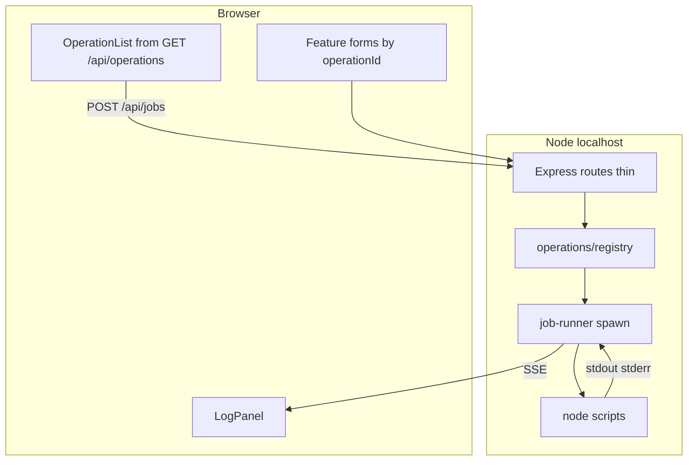

# Local web UI for WP migration POC

## Context

The repo is **plain Node** ([package.json](package.json)): AEM-focused scripts — `extract`, `transform`, `generate`, `pipeline:aem`, `build:aem-package`, `migrate-assets`. Scripts read [config/config.json](config/config.json) and paths under `data/` ([README.md](README.md)). Optional UI ([server/operations/registry.js](server/operations/registry.js)) groups operations: **primary** (full AEM migration), **steps** (1–4), **advanced** (migrate assets only).

## Scalability and extensibility (design goals)

Future you should add a **new button + backend behavior** by touching **one registry entry** (and optionally one small UI component), not by threading conditionals through a monolithic `server/index.js` or a single giant `App.jsx`.

**Backend**

- **Operation registry** (`server/operations/`): each operation is a small object: stable `id`, human `label`, `description`, `script` path relative to `scripts/`, optional `buildArgv(input)` for dynamic flags, and optional `schema` (JSON Schema or a minimal field list) so the UI can render forms from metadata later.
- **Generic runner** (`server/lib/job-runner.js`): takes `{ script, argv, cwd }`, tracks one active job (or a queue later), pipes stdout/stderr to SSE subscribers. Routes stay thin: validate `operationId`, resolve from registry, delegate to runner.
- **Discovery API**: `GET /api/operations` returns the list of operations (metadata only; no secrets). New process on the repo = **register one operation** + implement `buildArgv` if needed.
- **Composite operations**: `pipeline` is implemented as a **sequential runner** in the registry (array of steps) or a dedicated `type: "sequence"` entry—same runner primitives, so adding “lint then package” later is another registry row, not new infrastructure.
- **Future hooks** (document in code comments, not all built now): `preRun` / `postRun` hooks per operation; optional **plugin folder** `server/operations/plugins/*.js` auto-registered if you outgrow a single registry file.

**Frontend**

- **API module** (`web/src/api/client.js`): all `fetch` paths in one place so base URL and error shape evolve once.
- **Job hook** (`web/src/hooks/useJobStream.js`): start job + attach `EventSource`; UI components stay dumb about SSE details.
- **Operation-driven UI**: initial build reads `GET /api/operations` and renders **default “Run”** for simple ops; **special forms** (e.g. scrape URLs) live in `web/src/features/operations/ScrapeExtractForm.jsx` keyed by `operationId`. Adding a new op with only config defaults = **zero new React files**; adding one with custom inputs = **one small form component** + registry `formComponent` key or route map.
- **Feature folders**: `features/config/`, `features/artifacts/`, `features/logs/` so the shell layout (`App` + layout) does not absorb every future screen.

**Types (optional next step)**

- Adding **`web/tsconfig.json` + `.ts`** later is straightforward if the folder layout and API types are stable; v1 can stay JSX with JSDoc typedefs for `Operation` if you want minimal tooling.

## Recommended architecture

- **Backend**: **Express** app entry at `server/index.js`, bound to **`127.0.0.1`** only (local tool; avoids exposing command execution on the LAN).
- **Process execution**: **`spawn(process.execPath, ['scripts/<name>.js', ...argv], { cwd: ROOT })`** instead of `npm run` for consistent Windows/bash behavior and CLI args for `extract-scrape.js` (`--url`, `--discover`, `--selector`).
- **Logs**: **SSE** (e.g. `GET /api/jobs/:id/stream`) after `POST /api/jobs` returns `jobId`; keeps the runner generic for any future long-running process.
- **Concurrency**: Start with **reject if busy**; the same job-runner module can later swap in a **queue** without changing route signatures.

## UI features (match README operations)

Each item below is **one registry entry** (or a sequence entry) on the server; the UI either shows a single Run button or the scrape-specific form.

- **Run full AEM migration** → sequence: extract → transform → generate → build-aem-package (`pipeline:aem`)
- **Steps 1–4** → individual scripts
- **Migrate assets only** → `migrate-assets.js` (debug; normally inside step 4)
- Extract mode (wp-api / scrape / documents) is set in **config**, not separate UI overrides

Additional UX that removes “read the docs” friction:

- **Live log panel** (append stdout/stderr, clear on new run).
- **Status**: idle / running / success / failed with exit code.
- **Config editor**: `GET /api/config` and `PUT /api/config` reading/writing [config/config.json](config/config.json) with **JSON validation** on save. For **password fields** (`applicationPassword`), use a merge rule: if the client sends empty string, **keep the existing file value** so a quick save does not wipe secrets; show a “unchanged” placeholder in the UI.
- **Artifacts**: Static download routes or `GET` handlers for `data/transformed/migration-bundle.json` (optional pretty view) and `data/transformed/wp-to-aem-migration.zip` so users can grab outputs without hunting paths.

## Frontend stack

- **Vite + React** (or Vue—React is a sensible default) under e.g. `web/` with **dev proxy** (`vite.config` → proxy `/api` to the Express port) so the browser only talks to one origin in dev.
- **Production-ish local use:** `npm run build --prefix web` then `npm start --prefix server` (Express serves `../web/dist`).

## Optional frontend (how sharing / install works)

**Goal:** Zip or GitHub clone recipients who only want the migration scripts should run **`npm install` at the repo root** and never pull in Express, Vite, or React. UI adopters opt in with one documented command.

**Mechanism (recommended): separate package trees, no root workspaces**

- **Root** [package.json](package.json): keep **only** existing migration dependencies (`axios`, `archiver`, `fs-extra`, `node-html-parser`). Do **not** add `express` / `vite` / `react` here. Existing scripts (`extract`, `transform`, `pipeline`, …) unchanged.
- **`server/package.json`**: `express`, `concurrently` (dev), `server/index.js` entry; `npm run dev` runs API with watch optional; `npm start` runs API in prod mode (serves built `web/dist` when present).
- **`web/package.json`**: `vite`, `react`, `react-dom`; `npm run dev` runs Vite with proxy to API port; `npm run build` writes `web/dist`.

**Why not npm `workspaces` on the root:** a root workspace that includes `web` causes **`npm install` at root to install UI deps for everyone**, which defeats “optional.”

**Convenience scripts on the root** (no extra deps on root—use `npm`’s `--prefix`):

- `npm run install:ui` → `npm install --prefix server && npm install --prefix web` (UI deps only when chosen).
- `npm run dev:ui` → delegate to **`npm run dev:all --prefix server`** so **only `server/package.json`** needs `concurrently` (starts API + `npm run dev` in `../web`). Root stays free of new dependencies.
- `npm run build:ui` → `npm run build --prefix web`; `npm run start:ui` → `npm start --prefix server` (serves `web/dist`).

**Implementation note:** `server` resolves repo root as `path.join(__dirname, '..')` so `spawn` still targets `scripts/*.js` at the monorepo root; `web` Vite proxy targets the API port printed by the server.

**Git / zip:** Ignore `server/node_modules`, `web/node_modules`, `web/dist`. Core users never run `install:ui`. Optional **`.github/workflows`** can run UI build only on paths under `server/` or `web/` if you add CI later.

## Package.json / scripts (summary)

- Root: unchanged core deps; add **only** scripts that delegate (`install:ui`, `dev:ui`, `start:ui`, `build:ui`) using `npm --prefix server` / `npm --prefix web`—no new root dependencies.
- `server/package.json`: express, concurrently (dev); dev + start + `dev:all` if used.
- `web/package.json`: vite + react; build output `web/dist`.

## Files to add (indicative)

- `server/package.json`, `server/index.js` — mount routes only; no operation-specific logic here.
- `server/lib/job-runner.js` — spawn, job ids, SSE broadcast, busy guard (queue-ready).
- `server/operations/registry.js` — array or map of operation definitions; export `getOperation(id)`, `listOperations()`.
- `server/routes/jobs.js`, `server/routes/config.js`, `server/routes/artifacts.js` — optional split for clarity as the file count grows.
- `web/package.json`, `web/vite.config.*`, `web/index.html`, `web/src/main.jsx`, `web/src/App.jsx`, `web/src/api/client.js`, `web/src/hooks/useJobStream.js`, `web/src/features/operations/*`, `web/src/features/config/*`, `web/src/features/logs/*`.
- Update [.gitignore](.gitignore) for `web/dist`, `server/node_modules`, `web/node_modules` (root `node_modules` likely already ignored).

## Documentation

- **Two paths** at the top of the README (or a short `docs/control-ui.md` linked from README—only if you want to keep README short; user did not ask for new markdown files by default, so prefer a **README subsection**):
  - **Core (default):** `npm install` → use terminal commands from the existing tables; no UI folders required.
  - **Optional control UI:** `npm run install:ui` → `npm run dev:ui` (or the exact `npm run dev:all --prefix server` command you standardize on) → open browser URL, localhost-only security note, credentials in `config/config.json`.
- State explicitly that **pipeline behavior is identical** whether you use the UI or the terminal; the UI only spawns the same `scripts/*.js` files.

## Out of scope (unless you ask later)

- Refactoring scripts into importable functions (not required if spawning `node scripts/...`).
- Remote hosting or auth (would need a different threat model).
- Canvas-heavy analytics (Cursor canvas skill)—logs + buttons are enough here.

## Post-implementation

- After code changes, run `graphify update .` per workspace rule.
